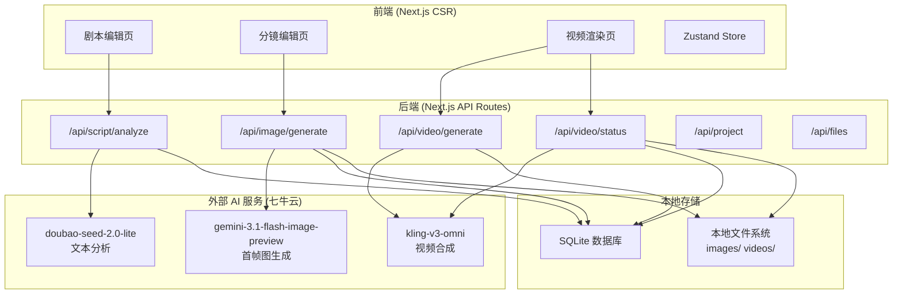

# AI 漫剧工作台 — 技术架构设计文档

## 一、技术选型

| 层级 | 选型 | 版本 | 理由 |
|------|------|------|------|
| 框架 | **Next.js** (App Router) | 15.x | 全栈框架，API Routes 处理后端 |
| 语言 | **TypeScript** | 5.x | 类型安全，适合复杂数据模型 |
| UI 样式 | **Vanilla CSS** + CSS Variables | - | 自定义设计系统，不依赖 UI 库 |
| 状态管理 | **Zustand** | 5.x | 轻量、TypeScript 友好 |
| 数据库 | **SQLite** + **Prisma ORM** | Prisma 6.x | 零配置、本地化、类型安全 |
| AI SDK | **OpenAI Node SDK** | 4.x | 七牛云 API 兼容 OpenAI 格式 |
| 文件存储 | **本地文件系统** | - | `public/uploads/` 目录 |

---

## 二、系统架构



---

## 三、目录结构

```
aivideo/
├── .env.local                    # 环境变量（API KEY 等）
├── next.config.ts
├── package.json
├── tsconfig.json
├── prisma/
│   ├── schema.prisma             # 数据库模型定义
│   └── dev.db                    # SQLite 数据库文件
├── public/
│   └── uploads/                  # AI 生成的图片/视频文件
│       ├── images/               # 首帧图
│       └── videos/               # 生成的视频
├── src/
│   ├── app/
│   │   ├── layout.tsx            # 根布局（侧边栏 + 顶栏）
│   │   ├── page.tsx              # 首页 → 重定向到剧本页
│   │   ├── globals.css           # 全局样式 + CSS 变量 + 设计系统
│   │   ├── script/
│   │   │   └── page.tsx          # 剧本编辑页
│   │   ├── storyboard/
│   │   │   └── page.tsx          # 分镜编辑页
│   │   ├── render/
│   │   │   └── page.tsx          # 视频渲染页
│   │   └── api/
│   │       ├── project/
│   │       │   └── route.ts      # 项目 CRUD
│   │       ├── script/
│   │       │   └── analyze/
│   │       │       └── route.ts  # 剧本 AI 分析
│   │       ├── image/
│   │       │   └── generate/
│   │       │       └── route.ts  # 首帧图生成
│   │       ├── video/
│   │       │   ├── generate/
│   │       │   │   └── route.ts  # 视频生成任务创建
│   │       │   └── status/
│   │       │       └── route.ts  # 视频生成状态查询
│   │       └── files/
│   │           └── route.ts      # 文件下载/管理
│   ├── components/
│   │   ├── layout/
│   │   │   ├── TopNav.tsx        # 顶部导航栏
│   │   │   └── SideNav.tsx       # 侧边导航栏
│   │   ├── script/
│   │   │   ├── ScriptEditor.tsx  # 剧本编辑器组件
│   │   │   ├── FragmentPanel.tsx # 片段面板
│   │   │   └── FragmentCard.tsx  # 单个片段卡片
│   │   ├── storyboard/
│   │   │   ├── ShotCard.tsx      # 分镜卡片
│   │   │   ├── ShotGrid.tsx      # 分镜网格
│   │   │   └── StyleBar.tsx      # 全局风格栏
│   │   └── render/
│   │       ├── VideoPreview.tsx  # 视频预览
│   │       ├── RenderParams.tsx  # 渲染参数面板
│   │       └── Timeline.tsx      # 序列时间轴
│   ├── lib/
│   │   ├── ai/
│   │   │   ├── client.ts         # OpenAI SDK 客户端初始化
│   │   │   ├── scriptAnalyzer.ts # 剧本分析逻辑
│   │   │   ├── imageGenerator.ts # 首帧图生成逻辑
│   │   │   └── videoGenerator.ts # 视频生成逻辑
│   │   ├── db.ts                 # Prisma Client 单例
│   │   └── fileStorage.ts        # 本地文件存储工具
│   ├── store/
│   │   ├── useProjectStore.ts    # 项目全局状态
│   │   ├── useScriptStore.ts     # 剧本编辑状态
│   │   ├── useStoryboardStore.ts # 分镜编辑状态
│   │   └── useRenderStore.ts     # 渲染状态
│   └── types/
│       └── index.ts              # 全局类型定义
```

---

## 四、数据模型 (Prisma Schema)

```prisma
// prisma/schema.prisma
generator client {
  provider = "prisma-client-js"
}

datasource db {
  provider = "sqlite"
  url      = "file:./dev.db"
}

model Project {
  id        String     @id @default(cuid())
  title     String     @default("未命名项目")
  script    String     @default("") // 完整剧本文本
  globalStylePrompt String @default("") // 全局风格 Prompt
  createdAt DateTime   @default(now())
  updatedAt DateTime   @updatedAt
  fragments Fragment[]
}

model Fragment {
  id        String   @id @default(cuid())
  projectId String
  project   Project  @relation(fields: [projectId], references: [id], onDelete: Cascade)
  order     Int      // 片段排序
  type      String   @default("general") // environmental / interaction / tension
  content   String   // 片段剧本内容
  status    String   @default("draft") // draft / shots_ready / rendering / completed
  videoTaskId String? // 视频生成任务 ID（七牛云返回）
  videoUrl  String?  // 生成的视频文件本地路径
  videoStatus String @default("idle") // idle / queued / in_progress / completed / failed
  createdAt DateTime @default(now())
  updatedAt DateTime @updatedAt
  shots     Shot[]
}

model Shot {
  id          String   @id @default(cuid())
  fragmentId  String
  fragment    Fragment @relation(fields: [fragmentId], references: [id], onDelete: Cascade)
  order       Int      // 分镜排序
  visualPrompt String  // 画面描述 Prompt
  cameraAngle String   @default("") // 镜头角度描述
  mood        String   @default("") // 情绪氛围
  imageUrl    String?  // 首帧图本地路径
  imageStatus String   @default("idle") // idle / generating / completed / failed
  createdAt   DateTime @default(now())
  updatedAt   DateTime @updatedAt
}
```

---

## 五、AI 接入层详细设计

### 5.1 统一客户端初始化

```typescript
// src/lib/ai/client.ts
import OpenAI from 'openai';

// 文本分析 & 图像生成共用同一客户端
export const aiClient = new OpenAI({
  apiKey: process.env.QINIU_API_KEY,
  baseURL: 'https://openai.sufy.com/v1',
});

// 视频生成使用七牛云原生 API
export const VIDEO_API_BASE = 'https://api.qnaigc.com/v1';
export const VIDEO_API_KEY = process.env.QINIU_API_KEY!;
```

### 5.2 剧本分析（文本 LLM）

```typescript
// src/lib/ai/scriptAnalyzer.ts
import { aiClient } from './client';

export interface AnalyzedFragment {
  order: number;
  type: 'environmental' | 'interaction' | 'tension' | 'dialogue' | 'action';
  content: string;
  shots: {
    order: number;
    visualPrompt: string;
    cameraAngle: string;
    mood: string;
  }[];
}

export async function analyzeScript(scriptText: string): Promise<AnalyzedFragment[]> {
  const response = await aiClient.chat.completions.create({
    model: 'doubao-seed-2.0-lite',
    messages: [
      {
        role: 'system',
        content: `你是一个专业的漫画分镜师。请分析以下剧本，将其拆分为多个片段(Fragment)。
每个片段应按照场景变化、情绪转换、动作节奏来划分。
每个片段应包含1-4个分镜(Shot)，描述具体的画面。

请以 JSON 格式返回，格式如下：
{
  "fragments": [
    {
      "order": 1,
      "type": "environmental|interaction|tension|dialogue|action",
      "content": "片段原文内容",
      "shots": [
        {
          "order": 1,
          "visualPrompt": "详细的画面描述，包括构图、光线、色调、角色位置",
          "cameraAngle": "wide_angle|medium|close_up|bird_eye|low_angle",
          "mood": "情绪关键词"
        }
      ]
    }
  ]
}

只返回 JSON，不要返回其他内容。`
      },
      {
        role: 'user',
        content: scriptText
      }
    ],
    temperature: 0.7,
    response_format: { type: 'json_object' },
  });

  const result = JSON.parse(response.choices[0].message.content || '{}');
  return result.fragments || [];
}
```

### 5.3 首帧图生成（Gemini Vision）

```typescript
// src/lib/ai/imageGenerator.ts
import { aiClient } from './client';
import fs from 'fs/promises';
import path from 'path';

export async function generateFirstFrame(
  visualPrompt: string,
  globalStylePrompt: string,
  shotId: string
): Promise<string> {
  const fullPrompt = globalStylePrompt
    ? `${visualPrompt}。整体风格：${globalStylePrompt}`
    : visualPrompt;

  const response = await fetch('https://openai.sufy.com/v1/chat/completions', {
    method: 'POST',
    headers: {
      'Authorization': `Bearer ${process.env.QINIU_API_KEY}`,
      'Content-Type': 'application/json',
    },
    body: JSON.stringify({
      model: 'gemini-3.1-flash-image-preview',
      messages: [
        {
          role: 'user',
          content: `请生成以下画面的漫画风格图片：${fullPrompt}`
        }
      ],
      modalities: ['image', 'text'],
      image_config: {
        aspect_ratio: '16:9'
      }
    }),
  });

  const result = await response.json();

  // 提取 base64 图片数据
  const images = result.choices?.[0]?.message?.images;
  if (!images || images.length === 0) {
    throw new Error('图片生成失败：无返回图片');
  }

  const base64Data = images[0].image_url.url;

  // 去除前缀，保存为文件
  const base64Content = base64Data.replace(/^data:image\/\w+;base64,/, '');
  const fileName = `${shotId}_${Date.now()}.png`;
  const filePath = path.join(process.cwd(), 'public/uploads/images', fileName);
  await fs.mkdir(path.dirname(filePath), { recursive: true });
  await fs.writeFile(filePath, Buffer.from(base64Content, 'base64'));

  return `/uploads/images/${fileName}`;
}
```

### 5.4 视频生成（Kling）

```typescript
// src/lib/ai/videoGenerator.ts
import { VIDEO_API_BASE, VIDEO_API_KEY } from './client';
import fs from 'fs/promises';
import path from 'path';

interface VideoCreateResponse {
  id: string;
  status: string;
  model: string;
}

interface VideoStatusResponse {
  id: string;
  status: 'queued' | 'in_progress' | 'completed' | 'failed';
  task_result?: {
    videos: { id: string; url: string; duration: string }[];
  };
  error?: { code: string; message: string };
}

// 创建视频生成任务（图生视频）
export async function createVideoTask(
  firstFrameImagePath: string,
  prompt: string,
  options: {
    size?: string;
    mode?: 'std' | 'pro';
    seconds?: '5' | '10';
  } = {}
): Promise<string> {
  // 读取首帧图文件并转为 base64
  const absolutePath = path.join(process.cwd(), 'public', firstFrameImagePath);
  const imageBuffer = await fs.readFile(absolutePath);
  const base64Image = `data:image/png;base64,${imageBuffer.toString('base64')}`;

  const response = await fetch(`${VIDEO_API_BASE}/videos`, {
    method: 'POST',
    headers: {
      'Authorization': `Bearer ${VIDEO_API_KEY}`,
      'Content-Type': 'application/json',
    },
    body: JSON.stringify({
      model: 'kling-v3-omni', // 用户指定模型
      prompt: prompt,
      image_list: [
        {
          image: base64Image,
          type: 'first_frame'
        }
      ],
      size: options.size || '1920x1080',
      mode: options.mode || 'std',
      seconds: options.seconds || '5',
    }),
  });

  const result: VideoCreateResponse = await response.json();
  return result.id; // 返回任务 ID
}

// 查询视频生成状态
export async function getVideoStatus(taskId: string): Promise<VideoStatusResponse> {
  const response = await fetch(`${VIDEO_API_BASE}/videos/${taskId}`, {
    headers: {
      'Authorization': `Bearer ${VIDEO_API_KEY}`,
    },
  });
  return response.json();
}

// 下载视频到本地
export async function downloadVideo(videoUrl: string, fragmentId: string): Promise<string> {
  const response = await fetch(videoUrl);
  const buffer = await response.arrayBuffer();

  const fileName = `${fragmentId}_${Date.now()}.mp4`;
  const filePath = path.join(process.cwd(), 'public/uploads/videos', fileName);
  await fs.mkdir(path.dirname(filePath), { recursive: true });
  await fs.writeFile(filePath, Buffer.from(buffer));

  return `/uploads/videos/${fileName}`;
}
```

---

## 六、API Routes 设计

| 路由 | 方法 | 功能 | 请求体 | 响应 |
|------|------|------|--------|------|
| `/api/project` | GET | 获取当前项目 | - | `Project` with relations |
| `/api/project` | PUT | 更新项目（剧本、标题等） | `{ title?, script?, globalStylePrompt? }` | `Project` |
| `/api/script/analyze` | POST | AI 分析剧本 | `{ scriptText }` | `{ fragments: Fragment[] }` |
| `/api/image/generate` | POST | 生成首帧图 | `{ shotId, visualPrompt, globalStylePrompt? }` | `{ imageUrl }` |
| `/api/video/generate` | POST | 创建视频任务 | `{ fragmentId, size?, mode?, seconds? }` | `{ taskId }` |
| `/api/video/status` | GET | 查询视频状态 | `?taskId=xxx` | `VideoStatusResponse` |
| `/api/files` | GET | 获取/下载文件 | `?path=xxx` | File stream |

---

## 七、状态管理设计

### Zustand Store 拆分

```typescript
// 项目级状态
interface ProjectStore {
  project: Project | null;
  loading: boolean;
  fetchProject: () => Promise<void>;
  updateProject: (data: Partial<Project>) => Promise<void>;
}

// 剧本编辑状态
interface ScriptStore {
  scriptText: string;
  fragments: Fragment[];
  analyzing: boolean;
  setScriptText: (text: string) => void;
  analyzeScript: () => Promise<void>;
  updateFragment: (id: string, data: Partial<Fragment>) => void;
}

// 分镜编辑状态
interface StoryboardStore {
  currentFragmentId: string | null;
  shots: Shot[];
  generatingImageIds: Set<string>;
  setCurrentFragment: (id: string) => void;
  generateImage: (shotId: string) => Promise<void>;
  updateShot: (id: string, data: Partial<Shot>) => void;
}

// 渲染状态
interface RenderStore {
  renderingFragmentIds: Set<string>;
  videoStatuses: Map<string, VideoStatus>;
  renderParams: RenderParams;
  startRender: (fragmentId: string) => Promise<void>;
  pollStatus: (fragmentId: string) => void;
  setRenderParams: (params: Partial<RenderParams>) => void;
}
```

---

## 八、异步任务轮询机制

视频生成和图片生成都是异步任务，需要轮询状态：

```typescript
// 通用轮询工具
async function pollUntilComplete<T>(
  fetcher: () => Promise<T>,
  isComplete: (result: T) => boolean,
  isFailed: (result: T) => boolean,
  options: {
    interval?: number;  // 轮询间隔 ms
    timeout?: number;   // 超时 ms
  } = {}
): Promise<T> {
  const { interval = 5000, timeout = 600000 } = options;
  const startTime = Date.now();

  while (true) {
    const result = await fetcher();
    if (isComplete(result)) return result;
    if (isFailed(result)) throw new Error('任务失败');
    if (Date.now() - startTime > timeout) throw new Error('任务超时');
    await new Promise(resolve => setTimeout(resolve, interval));
  }
}
```

---

## 九、设计系统（CSS Variables）

基于参考 UI 的 Kuro Creative Studio 深色主题：

```css
:root {
  /* Surface 层级 */
  --surface: #131313;
  --surface-container-lowest: #0e0e0e;
  --surface-container-low: #1c1b1b;
  --surface-container: #201f1f;
  --surface-container-high: #2a2a2a;
  --surface-container-highest: #353534;

  /* 品牌色 */
  --primary: #c0c1ff;
  --primary-container: #8083ff;
  --tertiary: #ffb95f;       /* AI 操作高亮 */
  --error: #ffb4ab;

  /* 文本色 */
  --on-surface: #e5e2e1;
  --on-surface-variant: #c7c4d7;
  --outline: #908fa0;
  --outline-variant: #464554;

  /* 字体 */
  --font-headline: 'Noto Serif', serif;
  --font-body: 'Inter', sans-serif;

  /* 间距 */
  --spacing-1: 0.25rem;
  --spacing-2: 0.5rem;
  --spacing-4: 0.9rem;
  --spacing-6: 1.3rem;
  --spacing-8: 1.75rem;

  /* 圆角 */
  --radius-sm: 0.125rem;
  --radius-md: 0.375rem;
  --radius-lg: 0.5rem;
  --radius-xl: 0.75rem;
}
```

---

## 十、环境变量

```env
# .env.local
QINIU_API_KEY=sk-74c8c906bc95eba19eeadc043411f9ad862eced5b590d9e0f79d113fc5e9a4d1

# 可选覆盖
QINIU_TEXT_BASE_URL=https://openai.sufy.com/v1
QINIU_VIDEO_BASE_URL=https://api.qnaigc.com/v1
TEXT_MODEL=doubao-seed-2.0-lite
IMAGE_MODEL=gemini-3.1-flash-image-preview
VIDEO_MODEL=kling-v3-omni
```

---

## 十一、本地文件存储策略

```
public/uploads/
├── images/
│   ├── {shotId}_{timestamp}.png     # 首帧图
│   └── ...
└── videos/
    ├── {fragmentId}_{timestamp}.mp4  # 生成的视频
    └── ...
```

- 图片和视频均保存在 `public/uploads/` 下，Next.js 可直接通过 URL 访问
- 文件命名使用 `{entityId}_{timestamp}` 格式避免冲突
- 重新生成时保留旧文件，数据库指向新文件

