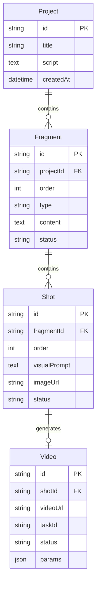

# AI 漫剧工作台 — 项目架构讨论

## 一、需求理解

基于你的描述和参考 UI，核心工作流为：


## 二、核心架构方案

### 方案：Next.js 全栈 Monorepo

```
aivideo/
├── src/
│   ├── app/                    # Next.js App Router
│   │   ├── page.tsx            # 首页 / 项目列表
│   │   ├── project/[id]/
│   │   │   ├── script/         # 剧本编辑页
│   │   │   ├── storyboard/     # 分镜编辑页
│   │   │   └── render/         # 视频渲染页
│   │   └── api/                # API Routes (后端)
│   │       ├── script/         # 剧本解析 & AI 片段划分
│   │       ├── image/          # 首帧图生成
│   │       └── video/          # 视频生成
│   ├── components/             # 共享 UI 组件
│   ├── lib/                    # 工具函数 & AI SDK 封装
│   └── store/                  # 状态管理 (Zustand)
├── prisma/                     # 数据库 Schema (SQLite)
└── public/                     # 静态资源 & 生成产物
```

### 为什么选 Next.js 全栈？

| 考量 | 说明 |
|------|------|
| **个人项目** | 不需要前后端分离部署，全栈框架最省心 |
| **API Routes** | 后端逻辑直接写在 Next.js 里，调 AI 接口、管理任务队列 |
| **SSR/SSG** | 项目列表等页面可用 SSR，编辑器页面用 CSR |
| **部署** | Vercel 一键部署，或 Docker 自托管 |

## 三、三大模块设计

### 1. 📝 剧本模块 (Script Editor)

**功能：** 输入/编辑剧本 → AI 自动划分为多个「片段 Fragment」

| 要素 | 方案 |
|------|------|
| 编辑器 | 轻量 ContentEditable 或 [CodeMirror](https://codemirror.net/) |
| AI 片段划分 | 调 LLM API（如 GPT/Claude），返回结构化 JSON |
| 数据结构 | `Fragment { id, type, text, shots: Shot[] }` |
| 交互 | 左侧剧本编辑，右侧 AI 片段列表（参考截图1） |

**AI 划分 Prompt 策略：**
- 输入完整剧本文本
- 要求 LLM 按「场景/情绪/动作」维度切分片段
- 每个片段标注类型（环境/互动/紧张 等）
- 返回 JSON 数组，前端直接渲染

### 2. 🖼️ 分镜模块 (Storyboard)

**功能：** 每个片段展开为若干分镜 Shot → 编辑 prompt → 生成首帧图

| 要素 | 方案 |
|------|------|
| 分镜卡片 | 卡片式横向排列（参考截图3） |
| Visual Prompt | AI 根据片段文本自动生成，可手动编辑 |
| 首帧图生成 | 调图像生成 API（Midjourney/DALL-E/SD） |
| 数据结构 | `Shot { id, fragmentId, prompt, imageUrl, status }` |

**关键交互：**
- 每个 Shot 卡片显示：缩略图 + prompt + 生成按钮
- 支持「生成首帧」和「重新生成」
- 全局风格 prompt（底部输入栏），可统一调整画风

### 3. 🎬 渲染模块 (Video Render)

**功能：** 首帧图 + 片段信息 → 视频大模型 → 15s 视频/片段

| 要素 | 方案 |
|------|------|
| 视频合成 | 调视频生成 API（如 Kling/Gen-3/Sora） |
| 参数控制 | Motion Scale / Steps / Seed / 合成引擎选择（参考截图2） |
| Timeline | 底部时间轴展示所有片段视频（参考截图2） |
| 导出 | 下载单个片段视频 / 打包全部 |

**异步任务设计：**
- 视频生成耗时长（可能 1~5 分钟/片段），需要异步轮询
- 后端启动生成任务 → 返回 taskId → 前端轮询状态
- 状态：`pending → generating → completed → failed`

## 四、数据模型



## 五、技术栈选型

| 层 | 选型 | 理由 |
|------|------|------|
| 框架 | **Next.js 15** (App Router) | 全栈、RSC、API Routes |
| UI | **Vanilla CSS** + CSS Variables | 参考 Kuro 设计系统，深色主题 |
| 状态 | **Zustand** | 轻量、适合编辑器状态 |
| 数据库 | **SQLite** (via Prisma) | 个人项目，零配置 |
| AI/LLM | **OpenAI SDK** 或对应平台 SDK | 剧本划分 + prompt 生成 |
| 图像 | 取决于你用的模型 API | Midjourney / SD / DALL-E |
| 视频 | 取决于你用的模型 API | Kling / Runway Gen-3 / Sora |

## 六、需要跟你确认的问题

> [!IMPORTANT]
> 以下问题会直接影响架构设计，请逐一回复：

1. **AI 模型选型：** 你打算用什么大模型做剧本解析？（GPT-4 / Claude / 其他）图像生成用什么？视频生成用什么？
2. **部署方式：** 你打算本地跑还是部署到云上？这影响数据库选型和文件存储方案
3. **是否需要多项目管理？** 还是先只做单一剧本的全流程？
4. **视频片段的关系：** 一个「片段 Fragment」对应一个 15s 视频，还是一个片段包含多个分镜（Shot），每个分镜生成一个视频？
5. **是否需要登录/用户系统？** 还是纯本地工具？
6. **你对 Next.js 的熟悉程度？** 是否有偏好的框架（如 Vite + React、Vue 等）？
